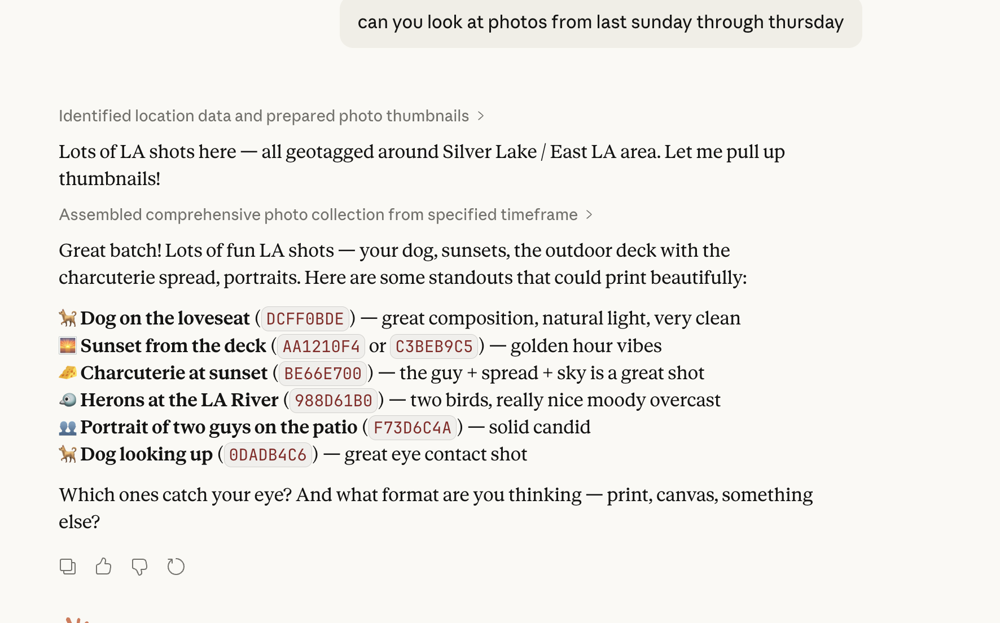

# PrintKit Photos MCP

An MCP server that connects your macOS Photos library to Claude. Browse photos, let Claude curate the best shots, and print them as metal prints, wood prints, gallery frames, and more via [PrintKit](https://printkit.dev).

Built on [morganp/photos-mcp](https://github.com/morganp/photos-mcp) (PhotoKit) + [PrintKit](https://printkit.dev) (print API by [Social Print Studio](https://www.socialprints.com)).

## How It Works

```
"Show me my photos from last weekend"
  → Claude searches your library, sees the thumbnails, picks the best shots
    → "Print that one as a metal print"
      → Photo exported, uploaded, order created, checkout opens in your browser
```

No API keys needed. No uploading to third-party services to browse. Your photos stay on your Mac until you choose to print.



## Status: Early & Experimental

This works end-to-end -- you can browse your photos, have Claude pick the best ones, and print them. But it's early. Some things to know:

- **Claude sees your photos but you don't (yet).** Thumbnails are sent as image data in the MCP response. Claude can analyze and describe them, but Claude Desktop doesn't currently render MCP tool images inline. So Claude curates and describes your photos in text, and you pick from its recommendations. This will likely improve as Claude Desktop evolves.
- **Photo search is based on metadata.** PhotoKit searches by date, media type, and filename -- not by visual content. Claude can't search for "photos of my dog" directly, but once it has thumbnails it can identify and recommend specific shots.
- **HEIC conversion is handled automatically.** Apple Photos stores everything as HEIC. The server converts to JPEG on export so print pipelines don't choke.

We're actively improving this. Contributions and ideas welcome.

## Tools

| Tool | Description |
|------|-------------|
| `find_photos` | Search by date range, media type, keyword — returns metadata + inline thumbnails Claude can see and curate |
| `print_photo` | Pick a product (metal, wood, frames, acrylic, large format), pass asset ID + size — handles export, upload, order, and opens checkout |

## Prerequisites

- macOS 13+
- Swift 6.1+ (Xcode 16+)
- Photos.app with photos in your library

## Install

```bash
git clone https://github.com/pushplace/printkit-photos-mcp.git
cd printkit-photos-mcp
swift build
```

The binary will be at `.build/debug/printkit-photos-mcp`. Use this path in the config below.

## Configure Claude Desktop

Open the Claude Desktop app, then go to **Settings > Developer > Edit Config**. This opens `claude_desktop_config.json`. Add the `mcpServers` block:

```json
{
  "mcpServers": {
    "photos": {
      "command": "/absolute/path/to/printkit-photos-mcp/.build/debug/printkit-photos-mcp"
    }
  }
}
```

Restart Claude Desktop after saving.

## Configure Claude Code

Add to `~/.claude.json`:

```json
{
  "mcpServers": {
    "photos": {
      "command": "/absolute/path/to/printkit-photos-mcp/.build/debug/printkit-photos-mcp"
    }
  }
}
```

## Photos Permission

On first launch, macOS will prompt for Photos access. If it doesn't appear, grant manually:

**System Settings > Privacy & Security > Photos > photos-mcp**

## How PrintKit Integration Works

No API key needed. The `print_photo` tool handles the full pipeline:

1. Exports full-res photo from your library via PhotoKit
2. Converts HEIC to JPEG automatically (Apple's default camera format isn't print-compatible)
3. Gets a presigned upload URL from PrintKit
4. Uploads the image to S3
5. Creates an order and opens the Shopify checkout in your browser

Available products include metal prints ($30–150), wood prints ($28–150), gallery frames ($53–250, black/white/natural, optional mat), acrylic blocks ($44–120), and large format prints ($9–60). Product and size are passed as parameters — the SKU is resolved automatically.

## Architecture

```
Sources/PhotosMCP/
  main.swift             -- entry point, auth, server setup
  PhotoKitService.swift  -- PhotoKit interactions (search, export, albums)
  ThumbnailService.swift -- batch thumbnail export via PHImageManager
  PrintKitService.swift  -- PrintKit API client (upload, order, catalog)
  ToolDefinitions.swift  -- MCP tool schemas
  ToolHandlers.swift     -- tool dispatch and argument parsing
Sources/Resources/
  Info.plist             -- embedded for TCC Photos permission
```

## Credits

- Photo library access via [morganp/photos-mcp](https://github.com/morganp/photos-mcp)
- Print fulfillment via [PrintKit](https://printkit.dev) by [Social Print Studio](https://www.socialprints.com)
- MCP protocol via [modelcontextprotocol/swift-sdk](https://github.com/modelcontextprotocol/swift-sdk)

## License

MIT
